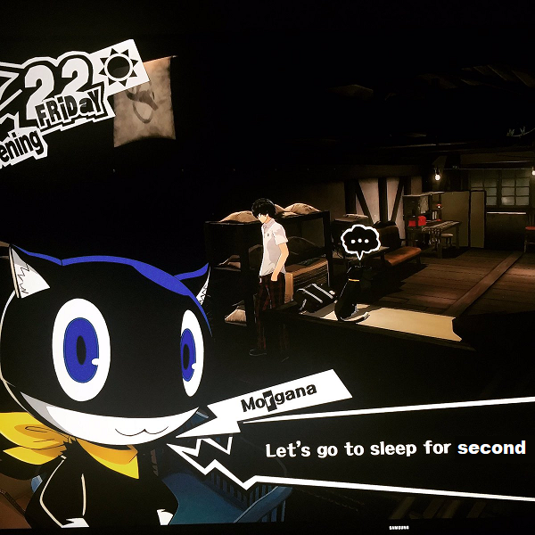
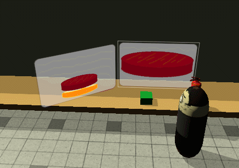

# SISOP 2019 : Modul 2 [Soal Shift] Kelompok D8

## #1 Sorted Factorial
### Pembuatan
* Mengurutkan variabel:
    ```c
	  int o, p, smt;
	  for(o = 0; o < i - 1; o++)
    {
        for(p = i - 1; p > o; p--)
        {
            if(factarr[p - 1] > factarr[p])
            {
                smt = factarr[p - 1];
                factarr[p - 1] = factarr[p];
                factarr[p] = smt;
            }
        }
    }
    ```
    Kenapa sorting dahulu? karena lebih mudah mensorting input, kemudian memanggil thread!
    
* Passing ke fungsi
    ```c
    err = pthread_create(&(tid[i]), NULL, factoriul, (void*)factarr[i]);
    ```
    lihat `(void*)factarr[i]`! ini ada bagian input untuk fungsi `factoriul`
    
    singkatnya, array `factarr` yang menyimpan input dipassing ke fungsi `factoriul`.
    
    Tapi, ditransform menjadi `void*`.
    
* Unsigned Long Long?

    untuk sekarang ini, melebihi 20an faktorial akan menghasilkan angka 0.
    
    Belum diketahui cara untuk membetulkan

## #5 Tamagochi warfare (ini kenapa ada di soal shift?)
### Pembuatan
* Input without enter!?!

  Sumber : https://stackoverflow.com/questions/1798511/how-to-avoid-pressing-enter-with-getchar
  
  singkatnya, 
  
  ada suatu manipulasi terminal untuk menangkap input (`getchar`) dan value `char` akan dijadikan `int` dalam variabel lain
  
* SLEEP

  
  
  While loop is inevitable supaya terasa dinamis.
  
  Dilakukan sebuah fungsi `sleep()` (bawaan, dalam satuan detik) untuk menunggu menuju loop lagi.
  
* Stok

  
  
  Memory sharing dilakukan agar program Penjual dan Pembeli bisa satu variabel (hanya satu variabel, `stock`)
